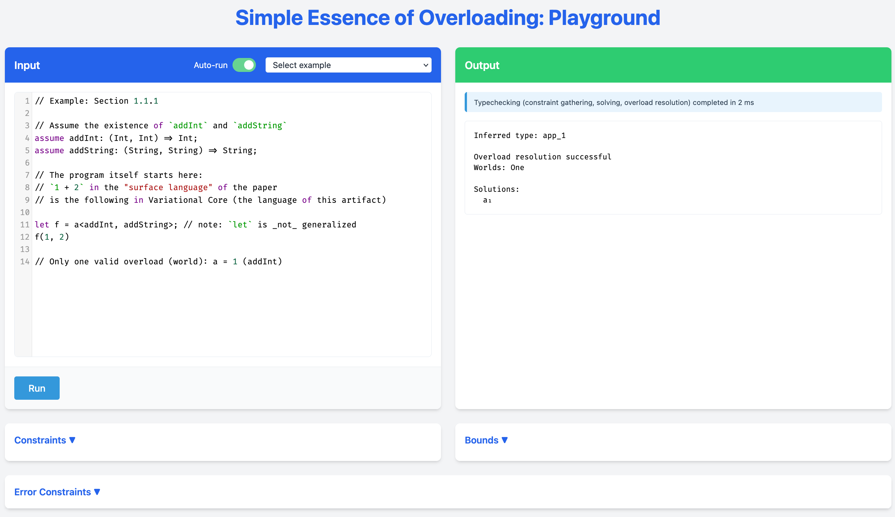

# Artifact of the paper 'The Simple Essence of Overloading'

> **Availability:** We will make our artifact available via Zenodo.

This GitHub repository contains the artifact of the paper:

> The Simple Essence of Overloading:
> Making ad-hoc polymorphism more algebraic with flow-based variational type-checking

## Overview

This artifact consists of:
- a prototype implementation of the calculus and the type inference pipeline (`.#native`),
- a web UI where a reader can input a term in Variational Core and get the rendered resulting type, constraints, and bounds of the calculus,
in addition to the result of overload resolution (`.#website`),
- a benchmark comparing a single kind of program with overloads of growing size against Swift (`.#benchmark`),
- and of a development environment for developing and testing the above.

All of the above is packaged using _Nix_, the packaging is declared in [flake.nix](./flake.nix).

### Paper Claims

The paper makes the following claims:

1. We present a flow-based variational framework that provides a semantic model of overload resolution as a search for a single possible world without type errors (Section 2), along with a formal variational calculus with type system and semantics (Section 3).
    - **Supported:** The artifact provides a complete prototype implementation of the variational calculus and type system in Rust, demonstrating all examples from the paper through both the native CLI and interactive web interface.
2. We formalize modular overload resolution with clear separation into distinct phases: constraint collection, constraint solving, overload resolution, and program specialization (Sections 4.1, 4.2, 4.4).
    - **Supported:** The prototype implementation in the artifact demonstrates constraint collection, solving, and overload resolution with clear phase separation as formalized in the paper. However, operational semantics and program specialization are **not** implemented, as we consider these to be routine transformations that do not demonstrate the novel contributions of the paper. Note that we also do not provide machine-checked proofs of these claims.
3. Our approach avoids typical problems of backtracking implementations through type-directed overload resolution with clear phase separation (Section 4).
    - **Supported:** The artifact demonstrates this through the prototype implementation, which uses the variational framework to avoid backtracking during overload resolution in a modular fashion, cleanly separating out overload resolution from constraint gathering and solving.
4. The performance and usability of our approach is viable in practice. (Section 5)
    - **Supported:** This is currently demonstrated through the performance benchmarks against Swift and through the scaling benchmarks, and through the interactive web interface demonstrating usability.

## Hardware Dependencies

- Tested on ARM64 macOS and x64 Linux
- Requires ≤8 GiB of disk space for Nix & the developer environment

## Getting Started Guide

This guide describes how to set up the dependencies for the artifact and
how to get the core pieces of the artifact up and running quickly.

### Setup

This artifact requires Nix with flakes support.
The Nix flake packages the project and ought to provide everything else needed to fully use, benchmark, and even develop the project.

The project was tested with upstream Nix versions 2.28.1 and 2.29.1 on ARM64 macOS and x64 Linux.

#### Installing Nix with flakes support

To install Nix, we recommend using the Determinate Nix installer available at <https://github.com/DeterminateSystems/nix-installer>
because of its good uninstall and macOS support. As of the time of writing, we recommend the reader to use upstream Nix,
not the Determinate fork of Nix (choosing "No" if the installer asks you if you want specifically "Determinate Nix").

To test your Nix installation and Nix flakes support, try running the following command
```bash
$ nix run nixpkgs#cowsay -- 'LGTM'
```

If this command shows an ASCII rendering of a cow saying `LGTM` in your terminal, then your Nix installation is likely correctly set up.

If you see an error like: `error: experimental Nix feature 'flakes' is disabled`,
you need to enable flakes by adding the following line to `~/.config/nix/nix.conf`:
```conf
experimental-features = nix-command flakes
```

In order to later uninstall Nix, please follow the instructions of `nix-installer` here: https://github.com/DeterminateSystems/nix-installer?tab=readme-ov-file#uninstalling.

### Quick Start

If you have Nix and tested that you have full Nix flakes support, here's how to quickly test out the artifact:

#### 1. Clone the repository

Run the following command to clone the repository and enter the resulting folder:
```bash
$ git clone git@github.com:se-tuebingen/oopsla-2025-artifact-overloading.git
$ cd oopsla-2025-artifact-overloading
```

#### 2. Try the benchmarking suite on a tiny input

Next, run the following Nix command to fetch all necessary dependencies (around 4 GiB of disk space), build the "native" program (around 2 GiB of disk space), run a tiny benchmark, and see its results:
```
$ nix run .#benchmark -- --sizes 5 10
$ cat benchmark_comparison.md
```

This variant of the benchmark runs for about a second on our computer.
You should see hyperfine output, the times should be roughly in units of milliseconds for `over` (this project) and in hundreds of milliseconds for `swift` (the Swift programming language equivalent).

Please ignore the warning 'Command took less than 5 ms to complete.', but please, **do not ignore** if at this point some command failed,
for example if the benchmarking tool returned a warning 'Command terminated with non-zero exit code'.

Finally, the `cat` command should show a Markdown-formatted table for easy overview. Here's an example:

| Command | Mean [ms] | Min [ms] | Max [ms] | Relative |
|:---|---:|---:|---:|---:|
| `over_size_5` | 3.6 ± 0.5 | 2.8 | 4.3 | 1.00 |
| `swift_size_5` | 140.3 ± 2.2 | 138.1 | 143.4 | 39.32 ± 5.93 |
| `over_size_10` | 4.3 ± 0.3 | 4.0 | 4.6 | 1.19 ± 0.19 |
| `swift_size_10` | 314.9 ± 1.8 | 312.7 | 317.5 | 88.22 ± 13.25 |

The benchmark itself is described later in section [Benchmarking](#benchmarking).

#### 3. Try out the interactive website

The artifact has its own website which you can bundle up and run locally using the following command.
This will build the WASM target, bundle it with `index.html` and the examples, and start a local web server on port 3000:
```
$ nix run .#website
```

The expected result in the command line is:
```
$ nix run .#website
Starting web server for overloading website...
WASM package directory: /nix/store/a1b2c3d4e5f6g7h8i9jk-overloading-wasm-0.1.0


   ┌──────────────────────────────────────────┐
   │                                          │
   │   Serving!                               │
   │                                          │
   │   - Local:    http://localhost:3000      │
   │   - Network:  http://127.0.0.1:3000      │
   │                                          │
   └──────────────────────────────────────────┘
```

Afterwards, please open your browser on the shown page, here `localhost:3000` and verify that you see the same page as on the image:



Finally, you can try editing the given example or selecting a different one from the dropdown menu (there should be plenty of examples available).
The output changes on every change in the editor after brief 5ms debouncing, showing the resolved overload or an error.

You can find more details on how to use the website in the section [Exploring the paper, interactively](#exploring-the-paper-interactively) below.

## Step by Step Instructions

There are four main commands that you might want to run, all of them are described in more detail below or in other linked Markdown documents.

- `nix run .#website` to run the website server (recommended using instead of running the native binary for exploration and experimentation)
- `nix run .#benchmark` to run the benchmark script
- `nix run .#native -- examples/arity.over` to run the CLI, native Rust binary (recommended for manual benchmarking) on an example
- `nix develop` to open a new Nix development shell with all dependencies for development

### Exploring the paper, interactively

We recommend using the website target -- run `nix run .#website`, then check the address, usually `localhost:3000`, then open it in your browser --
to explore example programs, modify them or even write your own programs in Variational Core by using the WASM target.

There are five sections ("boxes") on the website:
- The **editor** on the top left with rudimentary syntax highlighting where examples (both from the paper and outside of it) can be selected, run, and modified. The examples starting with `Section ...`, such as `Section 1.1.1` are direct, commented examples from the paper.
- The **output** on the bottom left which is updated on every keystroke, showing the (unsubstituted!) output type, if the overload resolution was a success or a failure (and why),
and the solution(s) in the paper notation.
- The collapsible **Constraints** section on the bottom left showing variational constraints gathered from the source program.
- The collapsible **Bounds** section on the bottom right showing variational bounds solved from the gathered constraints.
- The collapsible **Error Constraints** section on the very bottom showing constraints that can be used to reject worlds and the reason why it is an error constraint.

We also provide a syntax cheat sheet in [SYNTAX_CHEATSHEET.md](./SYNTAX_CHEATSHEET.md) for an easy overview of the supported syntactical constructs.

### Benchmarking

As of right now, there is only one small benchmark introduced in the rebuttal that compares our prototype against a similar program from Swift 5.8.
**Warning:** We are planning to revise this section as part of the major revision, see section [Paper claims](#paper-claims) for more details.

A small version of the program in Variational Core is available in `./examples/rebuttal-mini.over`.

The program is, in pseudocode:
```
let add: Int => Int = ...
let add: Str => Int = ...

let call: ∀R. (Int => R) => R = ...
let call: ∀R. (Str => R) => R = ...

let compose: ∀R. (R => R, R => R) => (R => R) = ...

print(call(bench))
```

where `bench` is, for `N = 2`: `compose(add, add)` and for larger `N` looks like: `compose(compose(..., add), add)`.
Therefore, `N` counts the `add` operations. The program is in CPS in order to mimic return-type overloading, which is otherwise unavailable in Swift.
The overload is always unambiguous, the correct solution can only ever use the `Int => Int` variant of `add`, since the `Str => Int` version cannot be composed.
In our terminology, each add will be a choice `a<callInt, callStr>` of a fresh dimension `a`.

The default benchmark can be run using Nix with the following commands:
```bash
$ nix run .#benchmark
```
By default, it uses sizes `N = 2, 4, ..., 16`, exactly as in the rebuttal.
You can run it for any sizes (any `N`s) you want with `nix run .#benchmark -- --sizes 5 7`.
You can also use `nix run .#benchmark -- --help` to see all available flags of the underlying `bench.py` script
which uses `hyperfine` to do the actual measuring.

Note that the Swift compiler is invoked in a mode which only type-checks in an attempt to eliminate other overhead.
Furthermore, we only test for N ≤ 16 since the Swift compiler gives up after approximately 3.5 minutes with:

> the compiler is unable to type-check this expression in reasonable time; try breaking up the expression into distinct sub-expressions

**Warning: Running the benchmark takes about 40 minutes.**
You're free to interrupt it with `Ctrl+C`, you'll still get the (partial output), please note that skipping the last test, `swift_size_16`, saves 30 minutes.
The output of the benchmark is located in `benchmark_comparison.{md, json}`. We recommend looking at the Markdown version of the output for a quick overview, disregarding the "baseline"
which is nonsensical for our purposes.

The Markdown version results for the full default run (plain `nix run .#benchmark`) is, as reported in the rebuttal, available in [data/benchmark_comparison_default.md](./data/benchmark_comparison_default.md).
Whereas "Over" (the prototype in this artifact) grows very slowly with increasing `N` (still within the realm of single milliseconds), the "Swift" version grows very rapidly with increasing `N`, from hundreds of milliseconds to hundreds of thousands of milliseconds (i.e., minutes).

If the reviewer only wants to run our prototype on `N = 50, 100` and not Swift, the command to be used is `nix run .#benchmark -- --sizes 50 100 --swift-cmd ':'`.
(Although the `hyperfine` tool we use to benchmark will complain that the benchmark times for Swift are 0, this will work correctly.)

_To reiterate, as a part of the major revision, we will be adding more benchmarks to the artifact at the later submission date (see section [Paper claims](#paper-claims))._

## Reusability Guide

Here's how to adapt the artifact for new inputs or new use cases.

### Writing more programs in Variational Core

In order to write more programs in Variational Core, we highly recommend the reader to use the website, described in the section [Exploring the paper, interactively](#exploring-the-paper-interactively) above.

### Writing and running more benchmarks

Currently, our benchmark suite is hardcoded for the one program from the rebuttal and it's nontrivial to update it.
Since we'll be adding more examples as a part of the _Major Revision_, this section will include more relevant details after the revision.

Nevertheless, you can run single programs using `nix run .#native -- $PROGRAM`,
or building the type-checker using `nix build .#native` and then running `result/bin/overloading $PROGRAM`.

Note that the compiler prints both the output and the rough timing:
```
Parsing: 64.375µs
Renaming and gathering choices: 15.583µs
Constraint gathering: 27.5µs
Constraint solving: 21.041µs
Overload resolution: 3.667µs
Getting all solutions: 833ns
Prettifying the output: 21.5µs
Total compilation: 110.916µs
Inferred type: app_1
Constraints:
  (Int, Int) => Int <:^a₁ over_a_0
  (String, String) => String <:^a₂ over_a_0
  over_a_0 <: (Int, Int) => app_1
Bounds:
  Int^a₁, String^a₂ <: app_1 <: ∅
  (Int, Int) => Int^a₁, (String, String) => String^a₂ <: over_a_0 <: (Int, Int) => app_1
Worlds: One
Solutions:
  a₁
```

Building first, and only then running is important for any benchmarking the reader might want to do on their own, as `nix run` _might_ attempt to rebuild.
Our benchmarking suite uses Nix to build once, then run.

### Exploring and adapting the codebase

Please refer to the standard [ARCHITECTURE.md](./ARCHITECTURE.md) document for an explanation of the architecture,
the development, and testing workflows (via `nix develop`), and overview and architectural invariants of each source file.

The codebase itself has a lot of basic unit tests and runs all the files in `examples/`, but the code is itself somewhat sparsely documented,
expecting an experienced reader to have some prior knowledge of how type-checkers look and the paper by their side.

Our main goal is _not_ performance at all costs -- a curious reader might see that we use imperfect data structures (representing type variables as strings, cloning them _everywhere_).
This is done in an effort preserve at least some readability of the underlying algorithm.
